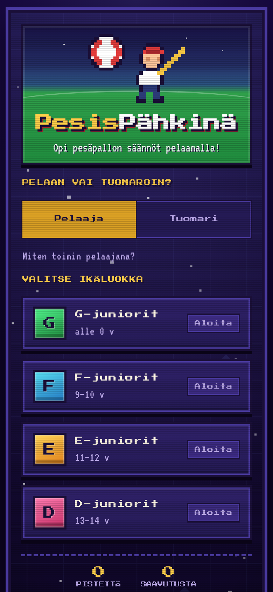
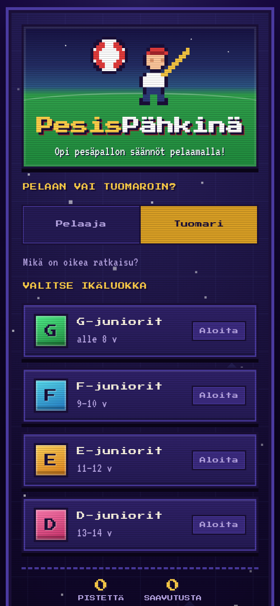
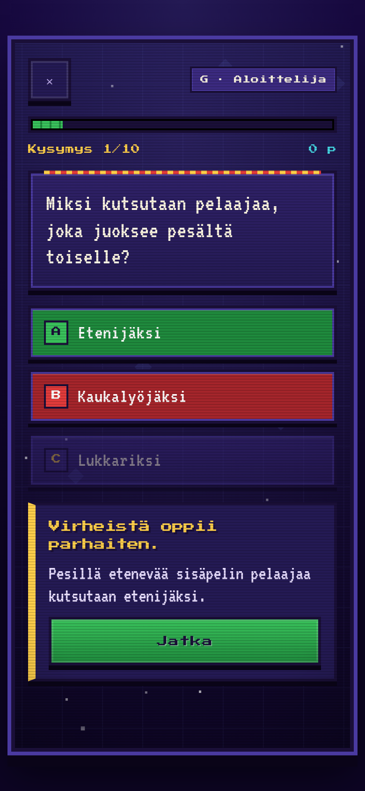
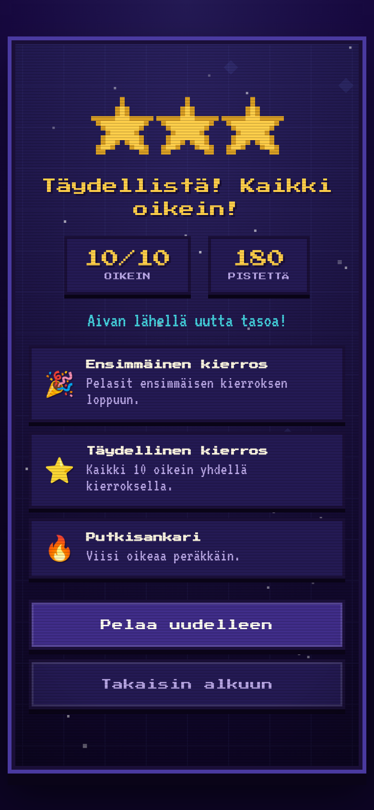

# PesisPähkinä

Mobiili ensin -selainpeli, joka opettaa pesäpallon sääntöjä lapsille ja heidän
vanhemmilleen. Toimii ilman kirjautumista ja ilman backendiä; eteneminen
tallennetaan selaimen localStorageen. Asennettavissa PWA:na.

**▶ Pelaa: https://pesispahkina.talonpoika.dev/**

## Kuvakaappaukset

<p>
  
  
  
  
</p>

<sub>Kotinäkymä · sama tuomari-näkökulmassa · välitön palaute selityksineen · tulosnäkymä juhla-animaatioineen</sub>

## Kehitys

```bash
npm install
npm run dev        # kehityspalvelin
npm run typecheck  # TypeScript
npm test           # Vitest (domain-logiikka + sisältö + smoke)
npm run build      # tuotantobuild (dist/)
npm run preview    # esikatsele tuotantobuildia
```

## Rakenne

```
src/
  domain/     puhdas pelilogiikka (pisteytys, eteneminen, kierros, skeema, saavutukset)
  data/       sisältö: kysymykset ja kannustavat kommentit
  storage/    localStorage-tallennus (yksi versioitu möykky)
  audio/      synteettiset Web Audio -äänet
  state/      React-tila (GameContext) — yksi pelimuoto sauman takana
  ui/         näkymät ja komponentit
```

## Dokumentaatio

- `CONTEXT.md` — sanasto (ubiikki kieli)
- `docs/adr/` — arkkitehtuuripäätökset (ADR:t)
- `docs/pesapallo-lahteet.md` — sääntöjen kanoniset lähteet ja termit
- `docs/pesapallo-ikaluokat.md` — ikäluokat (G–D)
- **`docs/agents/adding-content.md` — näin lisäät kysymyksiä, ikäluokkia ja pelimuotoja**
- `docs/backlog.md` — v2-ideat (mm. sovelluksen sisäinen palaute kysymyksestä)

## Tietosuoja

Käyttötilastot kerätään itse isännöidyllä Umami v3:lla
(`https://analytics.talonpoika.dev`): ei evästeitä, ei yksittäisen käyttäjän
tunnistamista, ei datan myyntiä. Tuotantodomainissa
`pesispahkina.talonpoika.dev` ladataan tavallinen tracker (`script.js`,
collector `/api/send`) sekä Umamin virallisen mallin mukainen `recorder.js`
heatmap-keruuta varten. Session Replay pidetään pois päältä Umamin asetuksissa,
eikä Distinct ID:tä, `identify`-kutsuja tai henkilötietoja käytetä. Ks.
`docs/adr/0009-analytiikka-umami.md`.

## Sisällön rajaus

Kaksi näkökulmaa: **pelaaja** (miten toimin pelaajana) ja **tuomari** (mikä on
oikea ratkaisu, kuka sen tekee ja miten se ilmoitetaan). Molempien alla ikäluokat
G, F, E, D ja vaikeustasot, jotka avautuvat kahdesta peräkkäisestä onnistuneesta
kierroksesta (≥ 8/10). Eteneminen on erillinen näkökulmittain (ks.
`docs/adr/0006-nakokulma-akseli.md`). Sisältö painottuu aloittelija-tasolle;
korkeammat tasot täydentyvät vaiheittain (ks. `docs/agents/adding-content.md`).
